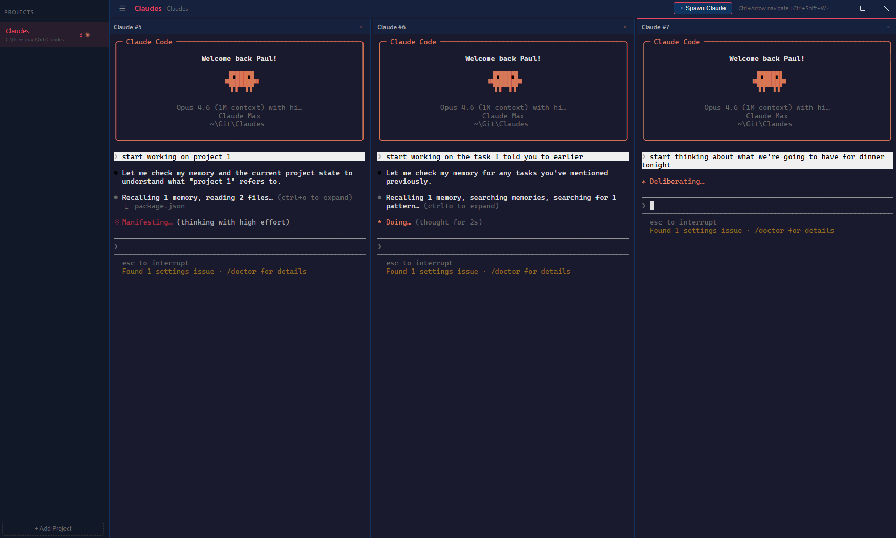

<p align="center">
  
</p>

<p align="center">
  <strong>A desktop IDE for Claude Code — run multiple AI coding agents side-by-side.</strong>
</p>

---

## What is Claudes?

Claudes is a **Claude Code GUI** — a desktop client that gives you a visual, multi-pane interface for running [Claude Code](https://claude.ai/claude-code) sessions. If you've been looking for a **Claude Code IDE**, a **Claude Code desktop app**, or just a better way to manage multiple AI coding agents at once, this is it.

I built it because I like running lots of Claude Code sessions at once and got tired of juggling terminal windows. It gives you a proper multi-column workspace where you can spawn, resize, and organise Claude Code instances by project — like a terminal multiplexer purpose-built for Claude.

It's not a commercial project — just a tool I made for myself that I thought others might find useful too. If you find a bug or have an idea, feel free to [raise an issue](https://github.com/paulallington/Claudes/issues) or send me a pull request.

## Screenshot

<p align="center">
  
</p>

## Features

- **Multi-column Claude Code terminals** — run multiple AI coding agents side-by-side in resizable panes
- **Project workspaces** — organise your Claude Code sessions by project, switch between them instantly
- **Persistent sessions** — switching projects preserves running Claudes in the background
- **Session resume** — remembers which Claude sessions were open per project and resumes them on restart
- **Resizable columns** — drag handles between columns to resize
- **Keyboard shortcuts**:
  - `Ctrl+Shift+T` — Spawn a new Claude
  - `Ctrl+Shift+W` — Kill focused Claude
  - `Ctrl+Arrow Left/Right` — Navigate between columns
  - `Ctrl+B` — Toggle sidebar

## Installation

### Prerequisites

- [Node.js](https://nodejs.org/) (v18+)
- [Claude Code CLI](https://claude.ai/claude-code) installed and available on your PATH

### Setup

```bash
git clone https://github.com/paulallington/Claudes.git
cd Claudes
npm install
npm start
```

A desktop shortcut can be created by running the included `claudes.vbs` via wscript.

## How it works

Claudes is an Electron-based desktop application that acts as a **graphical frontend for Claude Code**. Under the hood, it spawns a separate Node.js process (`pty-server.js`) that manages pseudo-terminal instances via [node-pty](https://github.com/microsoft/node-pty). The Electron renderer communicates with the pty server over WebSocket, rendering each Claude Code terminal with [xterm.js](https://xtermjs.org/).

This architecture avoids the need to compile native modules against Electron's Node.js headers — `node-pty` runs under the system Node.js using its prebuilt binaries.

Session state is saved per project (in `.claudes/sessions.json` within the project directory), so when you restart the app your Claude Code sessions are automatically resumed.

## Project structure

```
Claudes/
  main.js          — Electron main process
  pty-server.js    — WebSocket + node-pty server (runs under system Node.js)
  preload.js       — Electron context bridge
  renderer.js      — Frontend: columns, terminals, project management
  index.html       — App shell
  styles.css       — Dark theme
  icon.ico         — App icon
```

## Contributing

This is a personal project, but contributions are welcome! If you run into a problem, [open an issue](https://github.com/paulallington/Claudes/issues). If you want to add something, send a pull request and I'll take a look.

## License

See [LICENSE](LICENSE) for details. Free to use, but the source code may not be modified or redistributed without permission.

---

<p align="center">
  A <a href="https://www.thecodeguy.co.uk">The Code Guy</a> project
</p>
