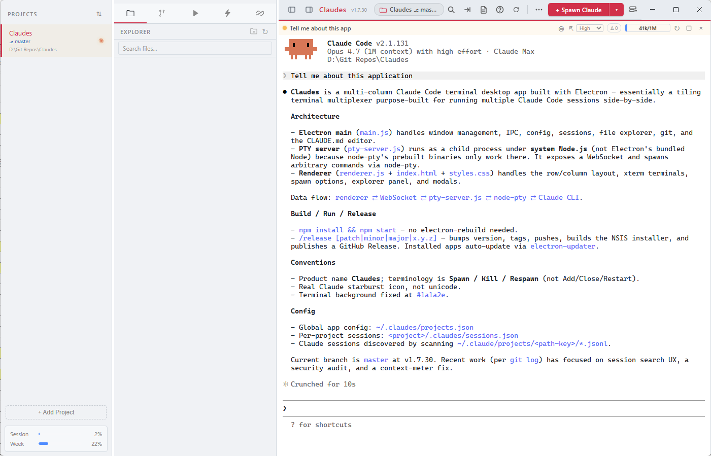
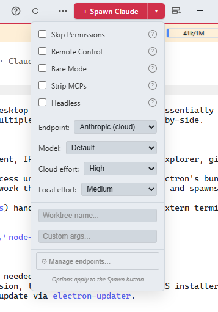
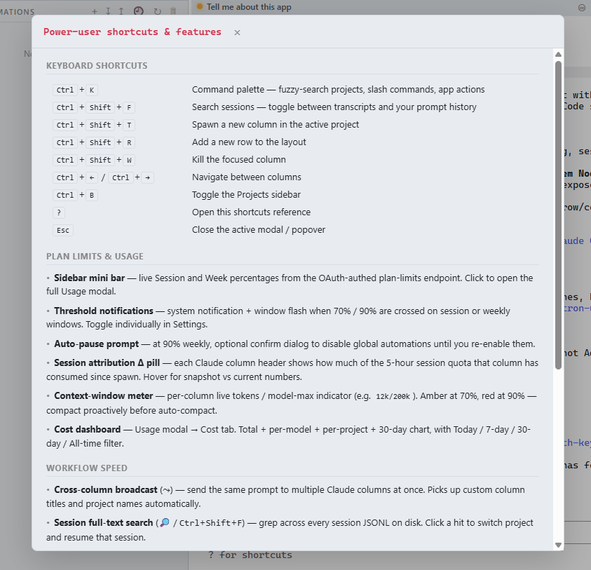
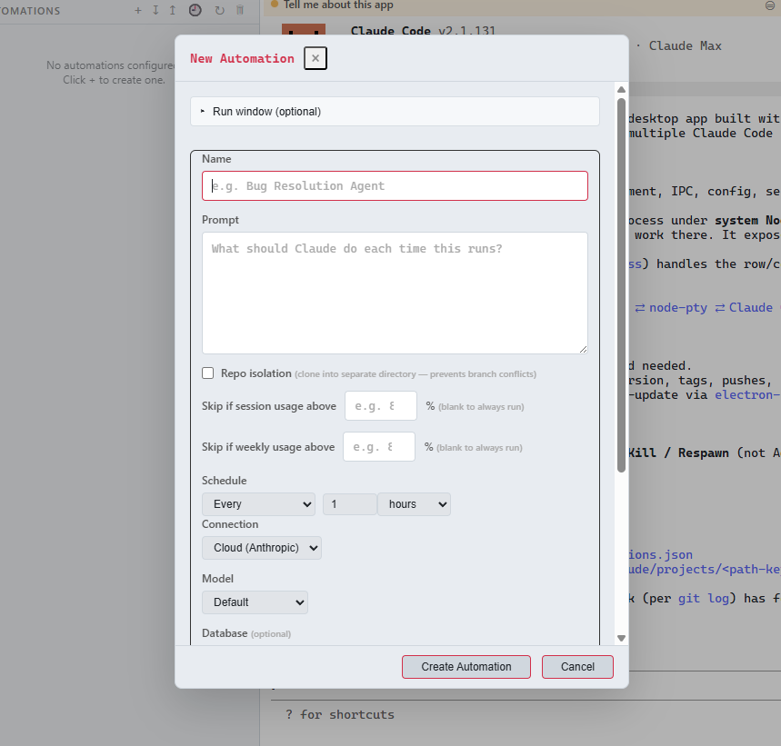
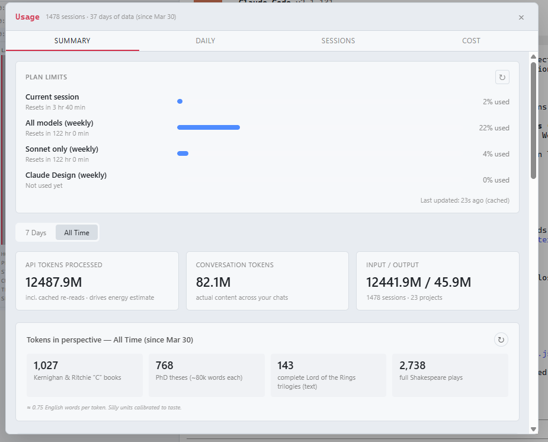

<p align="center">
  
</p>

<p align="center">
  <strong>A desktop IDE for Claude Code — run multiple AI coding agents side-by-side.</strong>
</p>

<p align="center">
  
</p>

---

## Install

Download the latest installer from [**GitHub Releases**](https://github.com/paulallington/Claudes/releases/latest) — grab the `.exe` and run it.

Claudes **auto-updates** in the background via [electron-updater](https://www.electron.build/auto-update); you'll get a notification when a new version is ready and it'll install on next launch.

> **Prerequisite:** [Claude Code CLI](https://claude.ai/claude-code) installed and on your `PATH`.

---

## What is Claudes?

Claudes is a **desktop GUI for Claude Code** — a tiling terminal multiplexer purpose-built for running multiple Claude Code sessions at once, organised by project. Spawn Claudes side-by-side, broadcast a prompt to several at once, search every transcript you've ever produced, watch your plan limits and per-column context windows in real time, and run unattended automations on a schedule.

I built it because I run a lot of Claude Code sessions in parallel and got tired of juggling terminal windows. It's a personal project, but it's been polished into something I use every day. Bug reports and PRs welcome — [issues here](https://github.com/paulallington/Claudes/issues).

---

## Highlights

- **Multi-column terminal workspace** — resizable rows + columns, drag-to-reorder, maximise, custom titles, activity indicators, popout windows per project
- **Endpoint presets with auto-failover** — swap between Anthropic Cloud and local LLMs (Ollama, vLLM, ngrok-tunnelled boxes…); set a fallback that takes over automatically if the primary disconnects
- **Plan-limits awareness** — live 5-hour and weekly utilisation in the sidebar, per-column Δ pill since spawn, threshold notifications at 70 % / 90 %, optional auto-pause of background automations at 90 % weekly
- **Context-window meter per column** — live tokens / model-max with amber at 70 %, red at 90 %, so you can compact proactively
- **Cost dashboard** — total, per-model, per-project breakdowns with 7-day / 30-day / All-time filters; tokens-in-perspective panel so the numbers actually mean something
- **Cross-column broadcast** — send the same prompt to multiple Claudes at once, with per-target opt-out
- **Session full-text search** (`Ctrl+Shift+F`) — grep every transcript on disk, scoped to the current project or across all of them; click a hit to switch project and resume
- **Prompt history search** — same modal, toggle to "My prompts" to grep your `~/.claude/history.jsonl`
- **Automations** — recurring or scheduled Claude Code agents with isolation, usage gates, per-agent endpoint/model, and an optional Mongo-backed coordination DB; "manager mode" lets a controller agent orchestrate the rest
- **Hooks inspector** — live feed of every Claude Code hook event with a one-click Connect button that wires `~/.claude/settings.json` for you
- **Snippets** — `\trigger` text expansion with `{{var}}` placeholders, expanded inline in any column terminal
- **Command palette** (`Ctrl+K`) — fuzzy-match projects, slash commands, and app actions
- **Built-in file explorer + inline editor**, **full git tab** (status, branches, stage, commit, push/pull, stash, diff viewer, commit log)
- **CLAUDE.md editor** for the active project
- **Run tab** — launch your app alongside Claude; auto-detects VS Code `launch.json` and .NET `launchSettings.json`; reusable env profiles
- **Headless runs**, **session resume on restart**, **dark / light / auto theme**

---

## Tour

### Spawn options

<p align="center">
  
</p>

The dropdown next to the **Spawn Claude** button is where you tune what gets launched: pick an endpoint preset (cloud or local), force a model, set effort independently for cloud and local backends, toggle Skip Permissions / Remote Control / Bare Mode / Strip MCPs / Headless, optionally launch into a fresh git worktree, and pass any extra CLI args.

### Power-user shortcuts & features

<p align="center">
  
</p>

Press <kbd>?</kbd> at any time to open the in-app reference. It covers every keyboard shortcut, every plan-limit / usage feature, and every workflow accelerator (broadcast, search, palette, snippets) — so you don't have to remember them.

### Automations

<p align="center">
  
</p>

Schedule recurring Claude Code agents per project. Each automation has:

- **Repo isolation** — clone the repo into a separate directory so concurrent agents don't fight over branches
- **Usage gates** — skip a run if 5-hour session or weekly utilisation is above a threshold
- **Schedule** — every N minutes / hours / days, or specific times on chosen weekdays
- **Connection + model** — pick any endpoint preset and override the model per agent
- **Optional database** — wire a Mongo connection so multiple agents can coordinate (or share state with a "manager" agent)
- **Run history** — every run logged with output, duration, cost, and status
- **Open in Claude** — pull a run's findings into a fresh interactive Claude session for follow-up

### Usage analytics

<p align="center">
  
</p>

The Usage modal (`Ctrl+U`) gives you four tabs:

- **Summary** — current plan-limit utilisation (5h / weekly Sonnet / weekly all-models / Claude Design), totals, and the tokens-in-perspective panel that converts your monthly throughput into K&R books, PhD theses, complete LOTR trilogies, and full Shakespeare plays
- **Daily** — token chart over time with cache-savings overlay
- **Sessions** — every session you've run with model, duration, token counts; click to inspect
- **Cost** — total + per-model + per-project + 30-day chart, filterable by Today / 7 days / 30 days / All time

---

## Keyboard shortcuts

| Shortcut | Action |
|---|---|
| <kbd>Ctrl</kbd>+<kbd>K</kbd> | Command palette — fuzzy-search projects, slash commands, app actions |
| <kbd>Ctrl</kbd>+<kbd>Shift</kbd>+<kbd>F</kbd> | Search session transcripts / prompt history |
| <kbd>Ctrl</kbd>+<kbd>Shift</kbd>+<kbd>T</kbd> | Spawn a new Claude in the active project |
| <kbd>Ctrl</kbd>+<kbd>Shift</kbd>+<kbd>R</kbd> | Add a new row |
| <kbd>Ctrl</kbd>+<kbd>Shift</kbd>+<kbd>W</kbd> | Kill the focused column |
| <kbd>Ctrl</kbd>+<kbd>Shift</kbd>+<kbd>M</kbd> | Maximise / restore focused column |
| <kbd>Ctrl</kbd>+<kbd>Shift</kbd>+<kbd>E</kbd> | Toggle Explorer panel |
| <kbd>Ctrl</kbd>+<kbd>1</kbd>‒<kbd>9</kbd> | Jump to column by number |
| <kbd>Ctrl</kbd>+<kbd>←</kbd>/<kbd>→</kbd> | Navigate between columns |
| <kbd>Ctrl</kbd>+<kbd>B</kbd> | Toggle sidebar |
| <kbd>Ctrl</kbd>+<kbd>Enter</kbd> | Commit staged changes (Git tab) |
| <kbd>Ctrl</kbd>+<kbd>=</kbd> / <kbd>−</kbd> / <kbd>0</kbd> | Zoom in / out / reset |
| <kbd>?</kbd> | Open the in-app shortcuts & features reference |
| <kbd>Esc</kbd> | Close active modal / popover |

---

## Building from source

```bash
git clone https://github.com/paulallington/Claudes.git
cd Claudes
npm install
npm start
```

Requires [Node.js](https://nodejs.org/) v18+ and the [Claude Code CLI](https://claude.ai/claude-code) on your `PATH`.

## How it works

Claudes is an Electron app. The Electron main process spawns a sidecar Node process — `pty-server.js` — which owns every PTY and speaks to the renderer over a local WebSocket. Each Claude column is an [xterm.js](https://xtermjs.org/) terminal wired to a [node-pty](https://github.com/microsoft/node-pty) PTY running `claude`. The pty-server runs under system Node so node-pty's prebuilt binaries work without an Electron rebuild.

```
Electron renderer  ⇄  WebSocket  ⇄  pty-server.js  ⇄  node-pty  ⇄  Claude CLI
```

The local WebSocket is gated by a per-launch random auth token (presented as a `Sec-WebSocket-Protocol` on connect) so other local processes can't reach the PTY surface. See [`docs/security/2026-05-06-audit-report.md`](docs/security/2026-05-06-audit-report.md) for the full security model.

App config lives in `~/.claudes/`; per-project session state in `<project>/.claudes/sessions.json`; Claude's own session JSONLs are read from `~/.claude/projects/<encoded-path>/`.

## Contributing

Personal project, but contributions welcome. [Open an issue](https://github.com/paulallington/Claudes/issues) for bugs or feature requests; PRs get reviewed.

## License

See [LICENSE](LICENSE). Free to use; source may not be modified or redistributed without permission.

---

<p align="center">
  A <a href="https://www.thecodeguy.co.uk">The Code Guy</a> project
</p>
